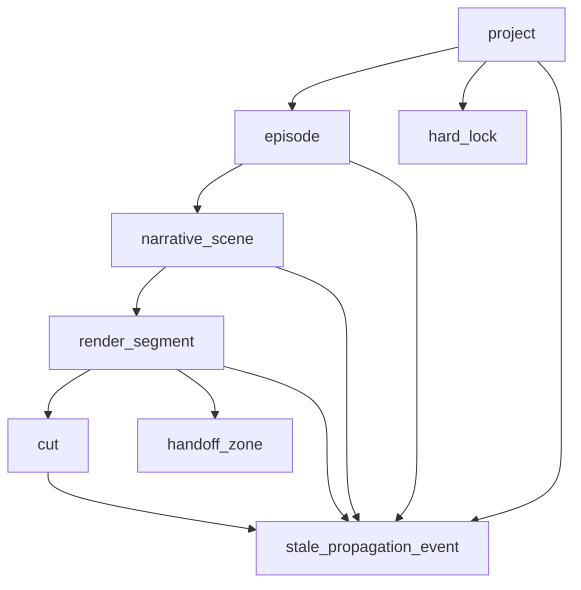

# Schema Relationships

## 约束说明

- `handoff_zone` 只引用 `render_segment` 边界，不内嵌到 `render_segment`
- `stale_propagation_event` 保存 source/target/trace/timestamp
- `render_segment` 不允许跨 `narrative_scene`
- `hard_lock` 是 `project` 级全局约束
